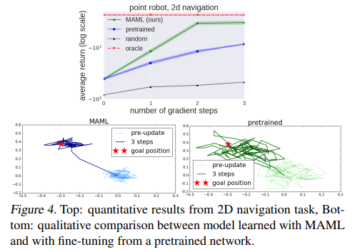

# A Review of "Model-Agnostic Meta-Learning for Fast Adaptation of Deep Networks"

## Introduction

### What is meta-learning?
Meta-learning is a subfield of machine learning that deals with the study of how to develop algorithms that learn how to learn. The goal of meta-learning is to develop algorithms that can quickly adapt to new tasks and domains by leveraging knowledge acquired from previous tasks. This is achieved by training the model on a set of meta-data that contains information about different data sets and learning tasks. The model then uses this information to adapt its learning process to the new data set or task. Meta-learning is particularly important in areas where data sets are limited or the cost of data collection is high. Meta-learning has applications in a wide range of fields, including natural language processing, computer vision, and robotics, among others.

### Why should anyone care about meta-learning?
Meta-learning is an important area of research because it has the potential to significantly improve the performance of machine learning algorithms and make them more efficient in adapting to new tasks and domains. Here are some reasons to care about meta-learning:

Faster learning: Meta-learning allows machine learning algorithms to learn faster from new data sets and tasks, as they can leverage the knowledge acquired from previous experiences. This can be seen as a better approximation of human learning where we only need a few examples of a hearing new word to be able to recognize it.

Better generalization: Meta-learning can help machine learning algorithms to generalize better to new data sets and tasks by learning to identify common patterns and features across different domains. This can lead to more robust and accurate models that perform well in a variety of settings.

Smaller Datasets: Meta-learning allows for the creation of robust models that learn quickly. This combination of attributes enables models to achieve strong results after finetuning on small data sets that would otherwise be insufficient.

Overall, meta-learning has the potential to improve the performance and efficiency of machine learning algorithms, making them more adaptable and effective in a wide range of applications.

### What is the history of meta-learning?
The concept of meta-learning has been around for several decades, but it was only in recent years with the advent of deep learning and big data that it gained significant attention from the research community. Here is a brief history of meta-learning:

Early work: The idea of meta-learning can be traced back to the 1980s, with the development of approaches such as "Evolutionary principles in self-referential learning. (On learning how to learn: The meta-meta-... hook.)" Juergen Schidhuber's thesis. These early approaches focused on building models that could learn how to learn from previous experience and apply that knowledge to new tasks.

The rise of deep learning: With the later advent of deep learning, there was renewed interest in meta-learning as a way to improve the performance and efficiency of deep learning models. Researchers began exploring new techniques such as "meta-learning with neural networks" and "model-agnostic meta-learning".

Current state of research: Today, meta-learning is a thriving area of research in machine learning, with researchers exploring a wide range of techniques and applications. The field of research is growing from on the scale of 1,000 publications between 2000 and 2010, to the scale of 10,000 publications between 2010 and 2020, and ~23,000 articles already published from 2020 to 2023. Some of the most promising areas of research include few-shot learning, where models are trained to quickly adapt to new tasks with only a few examples, and continual learning, where models are trained to learn continuously over time.

Overall, the history of meta-learning reflects a continued interest in developing models that can learn from previous experiences and apply that knowledge to new tasks, with the goal of improving the performance and efficiency of machine learning algorithms.

### What is Model-Agnostic Meta-Learning?
Model-Agnostic Meta-Learning (MAML) is a popular approach to meta-learning in deep learning, introduced by Finn et al. in 2017. MAML is a framework for learning a good initialization of the parameters of a neural network, such that it can quickly adapt to new tasks with only a few examples.

The main idea behind MAML is to learn a set of model parameters that can be easily fine-tuned for new tasks. In MAML, this is achieved by training a model on a set of tasks, and then using the gradients of the model's parameters with respect to the loss on the test set of each task to update the model's parameters. This allows the model to quickly adapt to new tasks by updating the parameters based on only a few examples.

The MAML algorithm can be summarized as follows:

1. Initialize model parameters randomly.
2. For each training task, compute the gradient of the loss with respect to the model parameters on the training set.
3. Use the gradient to update the model parameters.
4. Test the updated model on a validation set for each task.
5. Compute the average loss across all tasks on their validation sets.
6. Use the gradient of the average loss with respect to the initial parameters to update the initial parameters.
7. Repeat steps 2-6 for a fixed number of iterations.

MAML has shown promising results in few-shot learning, where models are trained to quickly adapt to new tasks with only a few examples. MAML is also model-agnostic, which means that it can be used with any model that is updated with a gradient descent based optimizer, making it a versatile and widely applicable approach to meta-learning.

## Evaluation

### How can we tell if the MAML algorithm works well?
When evaluating the performance of the MAML algorithm for meta-learning, there are several metrics that can be used to determine whether it is a good algorithm for the task at hand. Here are some key metrics to consider:

Accuracy or performance on new tasks: One of the most important metrics is how well the model performs on new tasks that it has not seen during training. This can be measured using metrics such as accuracy or loss, depending on the task.

Generalization: It is important to evaluate how well the model generalizes to new tasks that are different from the tasks seen during training. This can be measured by testing the model on tasks with different characteristics or testing it on tasks drawn from a different distribution.

Adaptation speed: MAML is designed to allow models to quickly adapt to new tasks with only a few examples. Therefore, it is important to evaluate how quickly the model can adapt to new tasks, as this is a key feature of the algorithm.

Sample efficiency: Another important metric is how sample-efficient the algorithm is, i.e., how well it can learn from only a few examples of each task. This is particularly important for few-shot learning tasks, where the model may only have access to a small number of examples for each new task.

Robustness: MAML should be able to adapt to new tasks even when there are small changes or perturbations to the task, such as changes in the data distribution or task description. Evaluating the model's robustness to these types of changes can help determine its overall reliability.

Overall, the metrics used to evaluate MAML will depend on the specific task and application. However, accuracy on new tasks, generalization, adaptation speed, sample efficiency, and robustness are all important factors to consider when evaluating the performance of the algorithm.

### How was MAML evaluated for regression tasks?
MAML was evaluated on regression using a sinusoidal regression task, where the goal was to predict the value of a sinusoidal function at a given input point. During meta-training, MAML was trained on a set of regression tasks, each corresponding to a different amplitude and phase of the sine wave. During meta-testing, MAML was tested on new regression tasks with different amplitudes and phases, where it was fine-tuned on a small number of examples (e.g., 10 points) and evaluated on its ability to predict the value of the sine wave at new input points. The performance of MAML was measured using the mean squared error (MSE) metric.

The performance of MAML was evaluated by comparing it to couple baseline algorithms, including a neural network trained using transfer learning and an oracle network that also recieved the phase and amplitude as ipnut. The oracle serves as an upper bound on performance. All netwroks used the same neural network architechture with 2 hidden layers of size 40 with ReLU nonlinearities and were optimized with the ADAM algorithm.

### How was MAML evaluated for classification tasks?
MAML was evaluated on classification tasks using two different datasets: Omniglot and mini-ImageNet.

For the Omniglot dataset, which consists of 1623 different handwritten characters from 50 different alphabets, the goal was to classify images of handwritten characters. During meta-training, MAML was trained on a set of classification tasks, each corresponding to a different subset of characters from the dataset. During meta-testing, MAML was tested on new classification tasks with different subsets of characters, where it was fine-tuned on a few examples from each class and evaluated on its ability to classify new examples from those classes. The performance of MAML was measured using the classification accuracy metric, which measures the percentage of correctly classified images.

For the mini-ImageNet dataset, the goal was to classify images of objects from 100 different classes. Similar to the Omniglot experiment, MAML was trained on a set of tasks, each corresponding to a different subset of the 100 classes. During meta-testing, MAML was tested on new classification problems, where it was fine-tuned on a small number of examples from each new class and evaluated on its ability to classify new images from those classes. The performance of MAML was also measured using the classification accuracy metric.

The performance of MAML was compared to several baseline algorithms. For Omniglot, MAML was compared to MANN (no conv), Siamese nets, matching nets, neural statistician, and memory modules. For mini-Imagenet, MAML was compared to fine-tuning baseline, nearest neighbor baseline, matching nets, and meta-learner LSTM.

### How was MAML evaluated for reinforcement learning tasks?
MAML was also evaluated on reinforcement with several sets of tasks based off of the simulated continuous control environments in the rllab benchmark suite. Specifically, the authors evaluated MAML on two tasks: 2D navigation and locomotion.

For the 2D navigation task, the goal was to train an agent to navigate a two-dimensional environment and reach a goal location as quickly as possible. During meta-training, MAML was trained on a set of navigation tasks, each corresponding to a different location in the environment. During meta-testing, MAML was tested on new navigation tasks, where it was fine-tuned on a few episodes of experience in a new environment and evaluated on its ability to reach the goal location in a few additional episodes. The performance of MAML was measured using the average return metric, which measures the cumulative reward obtained by the agent.

For the locomotion task, the goals were to train an agents to control the movements of two simulated robots - a planar cheetah and a 3D quadruped - to walk in a certain direction or at a certain velocity. During meta-training, MAML was trained on a set of locomotion tasks, each corresponding to a different target direction or velocity. During meta-testing, MAML was tested on new locomotion tasks, where it was fine-tuned on a few episodes of experience and evaluated on its ability to walk in a direction or at a speed. The performance of MAML was measured using the either the max speed of the robot, when walking in a direction, or the negative absolute value between the current velocity of the agent and a goal.

The performance of MAML was compared to three baseline models: pretraining one policy on all of the tasks and then fine-tuning, training a policy from randomly initialized weights, and an oracle policy which receives the parameters of the task as input. Each model was a neural network policy with two hidden layers of size 100, with ReLU nonlinearities.

## Results
### What were the results from the regression task evaluation?
The authors reported that MAML achieved significantly lower MSE compared to the baseline algorithms. They also showed that MAML was able to learn a good initialization that could be fine-tuned quickly to new regression tasks with only a five input-output pairs. Overall, these results demonstrated that MAML was effective in adapting quickly to new regression problems with limited data. 

### What were the results from the classification task evaluation?
MAML was evaluated on a classification task using the Omniglot dataset and the mini-ImageNet dataset. The performance was measured using the mean classification accuracy metric. It was compared to many different meta learning techniques from prior literature. The authors reported that MAML outperformed all prior meta learning techniuques included in the study on both the Omniglot and mini-ImageNet datasets, achieving higher few shot classification accuracy and faster adaptation to new classes.

![Few-shot classification on held-out Omniglot characters (top) and the MiniImagenet test set (bottom). MAML achieves results that are comparable to or outperform state-of-the-art convolutional and recurrent models. Siamese nets, matching nets, and the memory module approaches are all specific to classification, and are not directly applicable to regression or RL scenarios. The ± shows 95% confidence intervals over tasks. Note that the Omniglot results may not be strictly comparable since the train/test splits used in the prior work were not available. The MiniImagenet evaluation of baseline methods and matching networks is from Ravi & Larochelle (2017).](./figures/table 1.png "classification results")

### What were the results from the reinforcement learning task evaluation?
For the 2D navigation task, MAML demonstrated superior performance to the baseline training algorithms. The model that was trained with MAML managed to both improve in terms of average term and in number of graident updates needed to achieve better results. 

For the locomotion task, MAML once again outperforms the baseline methods. On three of the four tasks the model trained with MAML achieves nearly the same result as the Oracle model, which is the upper bound on performance.

![Reinforcement learning results for the half-cheetah and ant locomotion tasks, with the tasks shown on the far right. Each gradient step requires additional samples from the environment, unlike the supervised learning tasks. The results show that MAML can adapt to new goal velocities and directions substantially faster than conventional pretraining or random initialization, achieving good performs in just two or three gradient steps. We exclude the goal velocity, random baseline curves, since the returns are much worse (< −200 for cheetah and < −25 for ant).](./figures/figure 5.png "locomotion results")

## Discussion
One point of interest is in the results of the miniImagenet classification. There's an model trained with a first order approximation of MAML. This approximation takes the form of an identity matrix that replaces the Hessian in the meta loss gradient calculation. It was tested as a way to speed up calculation, and it achieved that goal by reducing computation time by about 33%. The authors expected this to reduce performance, but the data didn't match that expectation. The approximation performed on par with the standard implementation. The authors hypothesize that their use of the ReLU activation function in their networks has something to do with that due to ReLU's locally almost linear. This property suggests that second derivatives may be close to zero in most cases. It would be intersting to see if the approximation still performs on par if an alternative activation function, with a non-zero second derivative, like SiLU were used in the model.

## Conclusion

## References
